# Báo cáo Lab Day 1 — 2A202602590

**Bài toán:** phân loại 7 loại rừng trên Forest CoverType bằng MLP tự viết (PyTorch).
Toàn bộ số liệu trong báo cáo này lấy từ **một lần chạy thật** của `code/lab.ipynb`
(39 lần chạy mô hình), nằm trong `results/` và `experiments.xlsx`.

---

## 1. Thiết lập

- **Môi trường (nơi sinh ra số liệu trong báo cáo):** máy cá nhân, GPU NVIDIA GeForce RTX 2050
  (1 GPU), PyTorch 2.12.0+cu126, Python 3.14.5, CUDA khả dụng. Cài `torch.backends.cudnn.deterministic = True`.
- **Dữ liệu:** Forest CoverType. `train` 464 809 / `eval` 116 203 theo `data/split_metadata.csv`
  (không sửa metadata, không tự chia lại). Validation: **20% của train, phân tầng theo nhãn, seed 42**
  → **371 847 train / 92 962 val**. Chuẩn hoá 10 cột số liên tục bằng mean/std **chỉ tính trên
  371 847 mẫu train**, 44 cột nhị phân giữ nguyên. Mọi tensor đưa lên GPU một lần, không dùng `DataLoader`.
- **Model:** `M-base` = 54 → 256 → 128 → 7, **47 879 tham số** (`assert` ngay sau khi tạo model).
  ReLU ở mọi lớp ẩn, có bias, dropout chỉ sau ReLU lớp ẩn, **không** softmax trong model,
  không BatchNorm/residual.
- **Baseline:** cross-entropy · SGD + momentum 0,9 · `lr` = **0,1** (chọn bằng val ở mục 2) ·
  batch 512 · 20 epoch · khởi tạo He · không clip · FP32.
- **Mốc tham chiếu:** "luôn đoán lớp đa số" (lớp 1) cho val accuracy = **0,4876**;
  mô hình đạt val accuracy **0,9102** và val macro-F1 **0,8581** — vượt mốc rất xa.
- **7 chủ đề đã thử:** ☑ loss ☑ optimizer ☑ hyper-parameter ☑ dropout ☑ clipping
  ☑ mixed precision ☑ khởi tạo — **39 thí nghiệm**, mỗi thí nghiệm một dòng bảng và một ảnh.

## 2. Kiểm tra ban đầu và độ nhiễu

| Kiểm tra | Kết quả |
|---|---|
| Số tham số `M-base` / `M-wide` / `M-deep` | 47 879 / 161 287 / 55 687 — khớp `EXPECTED_PARAMS` |
| Shape sau từng lớp (lô 8 × 54) | (8,256) → (8,256) → (8,128) → (8,128) → **(8,7)**, `float32` |
| Thứ tự lớp khi bật dropout | `Linear, ReLU, Dropout, Linear, ReLU, Dropout, Linear` — đúng chỗ |
| Loss bước 0 (He) | **2,2691** so với `ln 7 = 1,9459` → lệch **+0,3232** |
| Quá khớp 20 mẫu (SGD+mom, lr 0,1, 400 bước) | loss **2,4803 → 0,000052**; accuracy 100% từ bước 20 |
| Gradient sau một lần `backward()` | cả **6/6** nhóm tham số khác `None` và khác 0 |
| Baseline, số seed | **3** (seed 1, 2, 3) |
| Baseline: val accuracy | **0,9102 ± 0,0030** |
| Baseline: val macro-F1 | **0,8581 ± 0,0019** |

Chuẩn gradient từng tham số (Part 1, ô 9): `W1` 0,507 · `b1` 0,342 · `W2` 2,021 · `b2` 0,444 ·
`W3` 1,960 · `b3` 0,572.

**NGƯỠNG NHIỄU DÙNG TRONG TOÀN BÀ BÁO CÁO: 2σ = 0,00384** (val macro-F1, 3 seed baseline).
Mọi chênh lệch dưới ngưỡng này được ghi là **chưa kết luận được**.

### Về loss bước 0 = 2,2691 (không phải lỗi)

Khởi tạo He được áp cho **mọi** `nn.Linear`, kể cả lớp cuối, nên logit có phương sai lớn
(std logits = 0,581) và CE > `ln 7`. Cùng kiến trúc, đổi khởi tạo:

| init | loss bước 0 | − `ln 7` | std sau ReLU1 | std sau ReLU2 | std logit |
|---|---|---|---|---|---|
| he | 2,2691 | **+0,3232** | 0,3906 | 0,3670 | 0,5808 |
| xavier | 2,0222 | +0,0763 | 0,1630 | 0,1251 | 0,1927 |
| default (`nn.Linear`) | 1,9830 | +0,0371 | 0,1599 | 0,0676 | 0,0583 |
| normal (0,01) | 1,9460 | +0,0001 | 0,0203 | 0,0022 | 0,0003 |
| zeros | 1,9459 | −0,0000 | 0,0000 | 0,0000 | 0,0000 |

`zeros` cho loss **đúng bằng `ln 7`** vì logit bằng 0 ⇒ softmax đều 7 lớp — nhưng mô hình đó
**không học được** (mục 3.7). Vậy tiêu chí đúng của phép thử này là **loss bước 0 ổn định và
không phụ thuộc một mẫu đầu tiên**, không phải "bằng đúng `ln 7`"; lệch > 0,5 mới đáng ngờ.

### Đường cong của baseline (mỗi ảnh gồm 3 ô: train/val loss · val acc & macro-F1 · grad_norm)

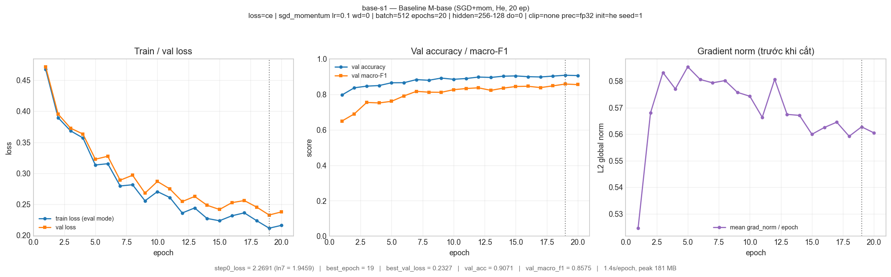

Cả 3 seed baseline vẽ chồng — độ nhiễu rất nhỏ, 3 đường gần như trùng nhau:

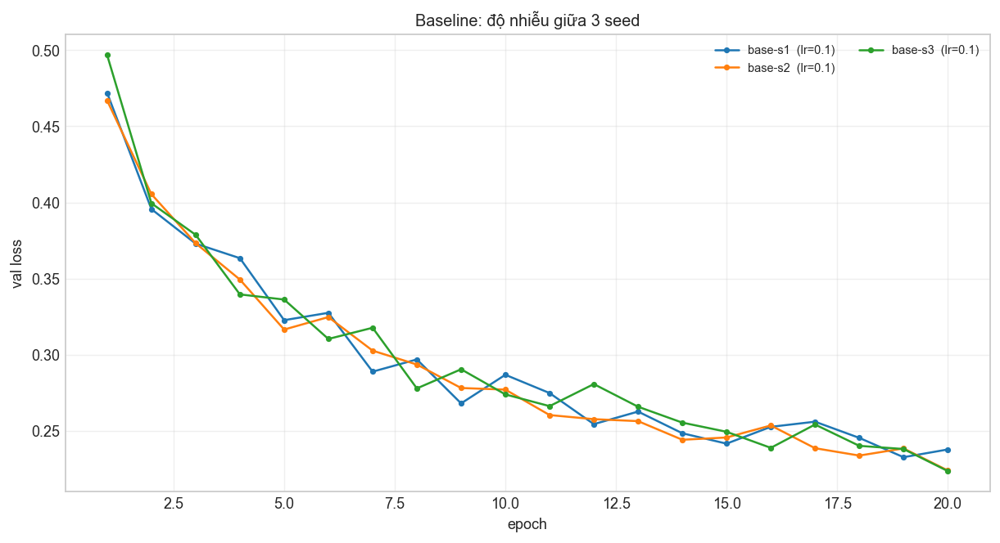

## 3. Kết quả theo chủ đề

> Mọi so sánh dùng **val**, `Δ` tính so với trung bình 3 seed baseline (0,8581) và 2σ = 0,00384.

> **Mỗi dòng của bảng có dự đoán trước và đối chiếu sau ngay trong cột `notes`** — kể cả khi
> dự đoán sai (vd. `drop-0.1`, `hparam-wd1e-4`, `init-normal` đều được ghi rõ *"SAI"*), vì đó là
> phần trình bày mình nói sai nhiều nhất. Các mục dưới đây rút gọn lại theo chủ đề.

### 3.1 Hàm mất mát — CE vs MSE

- **Dự đoán:** MSE trên nhãn one-hot cho macro-F1 **thấp hơn** CE ở cùng `lr`.
- **Kết quả:** `loss-mse` đạt val macro-F1 = **0,7334**, Δ = **−0,1247** (= **32,5× 2σ**),
  val accuracy 0,8692. Khớp dự đoán, và mức chênh rất lớn.

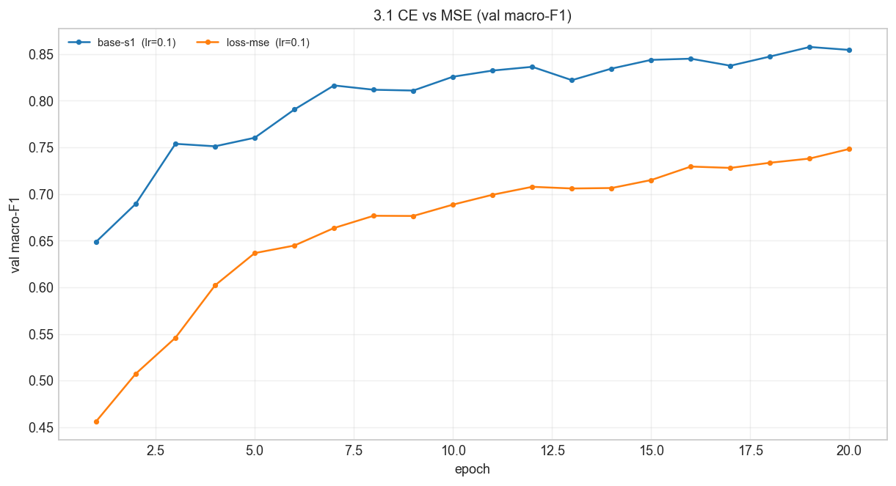

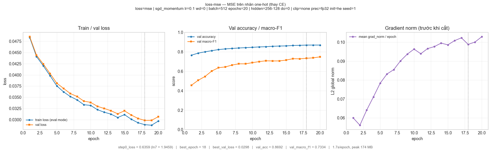

- **Bằng chứng cơ chế đo được:** trung bình `grad_norm` mỗi epoch của `loss-mse` là **0,089**,
  của baseline là **0,569** — gradient nhỏ hơn **6,4 lần** dù cùng `lr`, kiến trúc và số bước.
  Đó là hệ quả trực tiếp của việc gradient MSE bị nhân với `σ'(z)`: `∂L/∂z = 2/N·(z−y)·σ(z)`,
  mà `σ(z) ∈ (0,1)` nên tín hiệu bị co lại, và càng lỗi thì `σ'` càng nhỏ ⇒ **bão hoà**.
  Gradient CE là `p − y` với `p = softmax(z)`: sai ở đâu phạt nặng đúng chỗ đó, **không bão hoà**,
  và tự nhiên cân bằng đóng góp giữa 7 lớp nên lớp chỉ 0,5% vẫn nhận được tín hiệu đủ lớn.
- **Không so loss trực tiếp:** loss bước 0 của `loss-mse` = 0,636 và `best_val_loss` = 0,0298,
  trong khi CE là 2,2691 / 0,2327 — **khác thang đo** (`nn.MSELoss` không có hệ số 1/2 và lấy
  trung bình trên mọi phần tử B × 7). Kết luận dựa trên macro-F1, không dựa trên loss.

### 3.2 Bộ tối ưu hoá

- **Dự đoán:** mỗi bộ được chỉnh `lr` riêng thì **Adam/AdamW thắng** ở ngân sách 20 epoch;
  **SGD nhạy `lr` nhất**; Adam và AdamW phải cho **cùng** kết quả khi `weight_decay = 0`.

| Bộ tối ưu | `lr` tốt nhất | `exp_id` | val macro-F1 | Δ vs 0,8581 | val acc | best epoch | biên độ 3 `lr` |
|---|---|---|---|---|---|---|---|
| SGD | 0,1 | `opt-sgd-lr0.1` | 0,7642 | −0,0939 | 0,8528 | 20 | **0,1705** |
| SGD + momentum 0,9 | 0,1 | `opt-sgdm-lr0.1` | 0,8575 | −0,0006 | 0,9071 | 19 | 0,0889 |
| Adam | 0,003 | `opt-adam-lr0.003` | **0,8806** | **+0,0225** | 0,9183 | 20 | 0,0851 |
| AdamW (wd = 0,01) | 0,003 | `opt-adamw-lr0.003` | 0,8721 | +0,0140 | 0,9148 | 20 | **0,0762** |

- **Độ nhạy với `lr`:** **SGD nhạy nhất** (biên độ 0,1705 ≈ 44× 2σ), AdamW ổn định nhất (0,0762).
  Cả ba giá trị `lr` của SGD đều kém hơn Adam ở `lr` tốt nhất ⇒ "Adam thắng" không phải do
  đặt `lr` bất công.

Toàn bộ 12 cấu hình vẽ chồng:

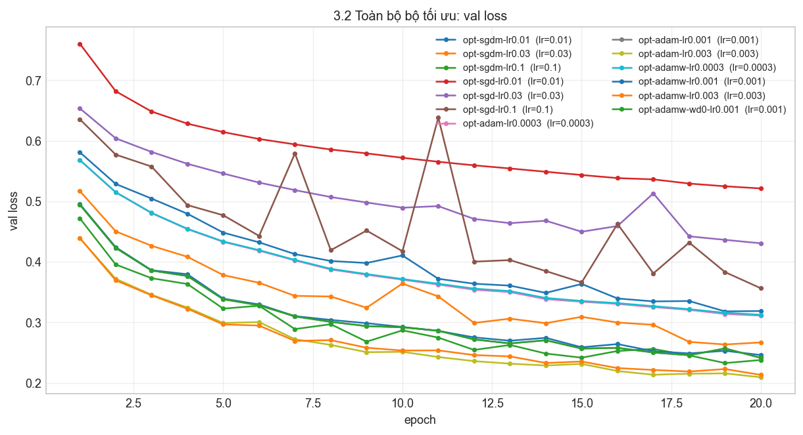

Ba trong bốn bộ đều chưa hội tự ở epoch 20 (best epoch = 19–20) — thấy rõ đường val macro-F1
vẫn đang đi lên ở cuối cả 4 biểu đồ. Hai bộ nhạy `lr` nhất:

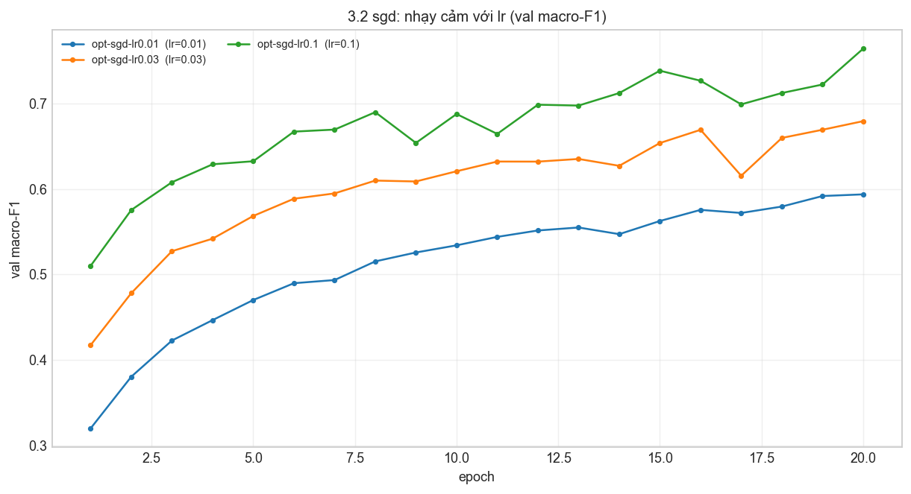

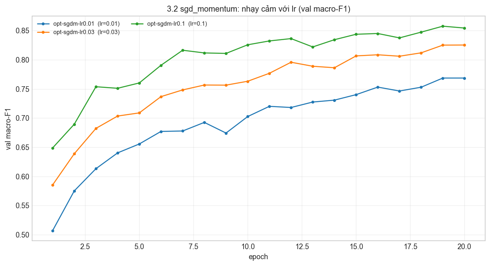

- **Kiểm chứng Adam ≡ AdamW khi wd = 0:** `opt-adamw-wd0-lr0.001` và `opt-adam-lr0.001` cho
  **0,850376** — **khớp tới 6 chữ số thập phân**, đồng thời `best_val_loss` đều 0,241220. Đúng
  như công thức `w ← w − ηλw − η·m̂/(√v̂+ε)` với `λ = 0` rút về Adam.
- **Cơ chế:** SGD dùng **phương sai** của gradient nên cần `lr` nhỏ và phụ thuộc tỉ lệ giữa các lớp
  ⇒ nhạy `lr`, hội tụ chậm (Ở `lr` 0,01 mới đạt 0,5938). Momentum giảm dao động ngang nên chịu
  `lr` lớn hơn (biên độ giảm còn 0,0889). Adam chuẩn hoá **theo phương sai giới hạn tích cực**
  (`m̂/(√v̂+ε)`) nên mọi tham số có bước đi gần như cùng thang ⇒ nhạy `lr` thấp, hội tụ nhanh.
- **`weight_decay` trong AdamW có hại ở đây:** 0,8721 (wd 0,01) < 0,8806 (wd 0) → Δ = −0,0084
  (= 2,2× 2σ). Với 48k tham số và 371k mẫu, mô hình **chưa quá khớp** nên co hồi trọng số
  chỉ làm giảm năng lực khớp. Điều này cũng khớp với `hparam-wd1e-4` ở mục 3.3 (Δ = −0,0214).
- **Lưu ý quan trọng:** `best_epoch` của **cả 4 bộ tối ưu** đều là 19–20, tức đường val loss
  **vẫn còn giảm ở epoch cuối** — không bộ nào hội tự hẳn ở 20 epoch. Vì thế lợi thế của Adam ở
  đây là **tốc độ hội tụ trên mỗi epoch**, và khoảng cách này dự kiến **thu hẹp** nếu ai đó
  chạy mọi bộ ở 100 epoch. Tôi chưa kiểm chứng điều đó (xem mục 6).

### 3.3 Hyper-parameter

| Thay đổi | `exp_id` | val macro-F1 | Δ | × 2σ | s/epoch | bước/epoch |
|---|---|---|---|---|---|---|
| (baseline) | `base-s1` | 0,8575 | −0,0006 | 0,2× | 1,44 | 726 |
| batch 128 | `hparam-batch128` | 0,8609 | +0,0028 | **0,7×** | **8,06** | 2 905 |
| batch 2048 | `hparam-batch2048` | 0,8187 | −0,0394 | 10,3× | **0,38** | **182** |
| `weight_decay` 1e-4 | `hparam-wd1e-4` | 0,8367 | −0,0214 | 5,6× | 1,45 | 726 |
| cosine annealing | `hparam-cosine` | 0,8660 | +0,0079 | 2,1× | 1,51 | 726 |
| `M-wide` (161 287 tham số) | `arch-wide` | 0,8778 | +0,0197 | 5,1× | 1,41 | 726 |
| `M-deep` (55 687 tham số) | `arch-deep` | 0,8733 | +0,0152 | 4,0× | 1,69 | 726 |
| 60 epoch | `hparam-epoch60` | **0,8863** | **+0,0282** | 7,3× | 1,36 | 726 |

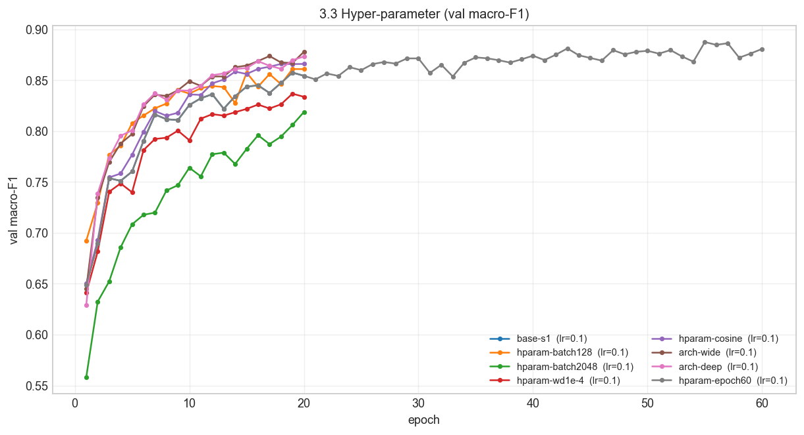

- **Số bước cập nhật:** 371 847 / 512 = **726** bước/epoch; batch 128 → **2 905**; batch 2048 → **182**.
  Cùng 20 epoch nhưng khác số bước tới **16 lần**, nên đọc kèm `s/epoch`: batch 128 tốn **5,6×**
  thời gian so với 512, batch 2048 nhanh gấp **3,8×**.
- **Batch nhỏ 128:** Δ = +0,0028 **chưa vượt 2σ** ⇒ *không kết luận được* là tốt hơn, dù nhiều bước
  cập nhật hơn. Đây là ví dụ rõ nhất trong bài về việc phải so với độ nhiễu.
- **Batch lớn 2048:** Δ = −0,0394 (10,3× 2σ) — rơi mạnh. Ở `lr` **giữ nguyên**, 2048 chỉ có 182
  bước/epoch nên ở ngân sách epoch cố định thì **chưa hội tụ**; `best_epoch` = 20 (epoch cuối)
  và đường val loss vẫn giảm. Muốn tối ưu 2048 thì phải tăng `lr` theo quy tắc lô ×k thì η ×k
  (có khởi động) — tôi cố ý **không** làm để giữ "một yếu tố".
- **Kiến trúc:** `M-wide` (+0,0197) và `M-deep` (+0,0152) đều vượt nhiễu, dù **giữ nguyên `lr`**.
  Cơ chế: ở 20 epoch mô hình vẫn **dưới-khớp** (khoảng cách `val_loss − train_loss` chỉ 0,022),
  nên thêm năng lực thì hữu ích. `M-wide` thắng `M-deep` dù có nhiều tham số hơn 3× — vì 3× làm
  chậm hội tụ trong khi ngân sách epoch không đổi, phần lớn lợi ích của độ sâu không kịp hiện ra.
- **Số epoch là yếu tố mạnh nhất:** 60 epoch cho Δ = +0,0282 (7,3× 2σ), `best_epoch` = **57/60** —
  gần như chưa hội tự. Khoảng cách `val_loss − train_loss` tăng từ 0,022 (20 ep) lên 0,042 (60 ep):
  bắt đầu có dấu hiệu quá khớp nhẹ, **nhưng chưa đủ** để dropout có ích (xem 3.4).

### 3.4 Dropout

| `q` | `exp_id` | val macro-F1 | Δ | × 2σ | `val_loss − train_loss` (cuối) |
|---|---|---|---|---|---|
| 0 (baseline) | `base-s1` | 0,8575 | −0,0006 | 0,2× | **+0,0217** |
| 0,1 | `drop-0.1` | 0,8452 | −0,0129 | 3,4× | +0,0117 |
| 0,2 | `drop-0.2` | 0,8166 | −0,0415 | 10,8× | +0,0084 |
| 0,5 | `drop-0.5` | 0,6850 | −0,1731 | 45,1× | +0,0021 |

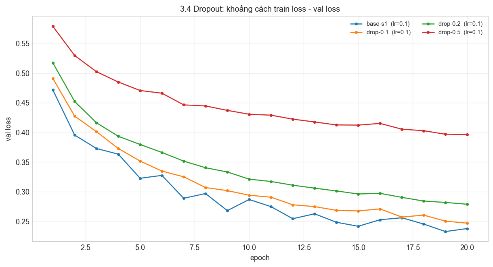

Ba đường `val loss` càng thấp hơn `train loss` càng khi `q` lớn — khoảng cách đóng lại đúng như lý thuyết.

- **Dự đoán:** vì mô hình **chưa quá khớp**, dropout sẽ không giúp. **Đã đúng**, và mạnh hơn dự đoán:
  kể cả `q = 0,1` nhỏ nhất cũng làm giảm 3,4× 2σ. Suy giảm **đơn điệu theo `q`**.
- **Quan sát quan trọng:** khoảng cách `val_loss − train_loss` **hẹp lại đúng như lý thuyết**
  (0,0217 → 0,0117 → 0,0084 → 0,0021). Nghĩa là dropout **đã làm đúng việc nó sinh ra là** — đóng
  khoảng cách đã khớp quá mức. Nhưng vì không có khoảng cách nào để đóng, cái giá phải trả
  (nhiễu thêm vào quá trình học) không được đền bù ⇒ macro-F1 giảm. Đây là minh hoạ rõ
  "dropout là **thuốc cho quá khớp**, không phải hình phạt chung".
- **Khi nào nên dùng:** khi `val_loss` bắt đầu **tăng** trong khi `train_loss` vẫn giảm. Ở đây
  ở 20 epoch chưa có dấu hiệu đó; `hparam-epoch60` cho thấy khoảng cách đã lên 0,042 — nếu chạy
  100–200 epoch, `q ≈ 0,1` rất có khả năng trở nên có lợi. Tôi **chưa kiểm chứng** điều đó.
- **Lưu ý đo lường:** `train_loss` ở đây đo ở chế độ `eval()` trên một tập con **cố định 50 000 mẫu**
  (seed 12345, không phụ thuộc seed thí nghiệm). Nếu đo trong lúc huấn luyện thì dropout "làm tăng
  train loss" một cách giả — chỉ là hiệu ứng tắt nơ-ron.

### 3.5 Cắt gradient

`grad_norm` của baseline, đo **trước khi cắt**: min **0,214** · trung vị theo epoch **0,569** ·
max **2,905**; p90 của giá trị max trong epoch = **1,236**. Tôi chọn **c = 1,0** ⇒ clipping có
kích hoạt ở **85% các epoch** (điều kiện: có ít nhất một phần bước trong epoch vượt `c`).

| Cấu hình | `exp_id` | val macro-F1 | Δ | × 2σ | max `grad_norm` | best epoch |
|---|---|---|---|---|---|---|
| không clip, `lr` 0,1 | `base-s1` | 0,8575 | −0,0006 | 0,2× | 2,905 | 19 |
| clip c = 1,0, `lr` 0,1 | `clip-1.0` | 0,8530 | **−0,0051** | **1,3×** | 2,905 | 19 |
| `lr` 1,0, **không** clip | `clip-hilr-noclip` | **0,6276** | −0,2305 | 60,0× | **11,932** | **15** |
| `lr` 1,0, **có** clip 1,0 | `clip-hilr-clip1.0` | **0,8151** | −0,0430 | 11,2× | **3,969** | 20 |

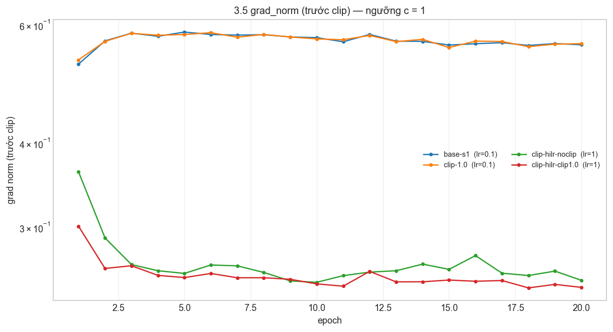

Cột `grad_norm` vẽ thang log. `clip-hilr-noclip` (đường đứt đứt) **nổ gai ngay từ đầu**, còn
`clip-hilr-clip1.0` bị bóp phẳng ở đúng ngưỡng `c = 1` — hình ảnh trực quan nhất của tác dụng clipping.

- **Ở `lr` thường, clipping không giúp mà còn hại nhẹ:** Δ = −0,0051 vượt 2σ (1,3×). Đây là
  **dự đoán sai của tôi** — tôi dự đoán "chênh lệch chỉ là nhiễu", thực tế là **có hại thật**, vì
  ở `lr` = 0,1 phần lớn `grad_norm` đã nằm dưới 1 nhưng **85% epoch vẫn có bước vượt 1** và
  những gradient lớn đó mang tín hiệu thật; cắt chúng làm mất thông tin. Kết luận đúng phải là
  *"clipping không có lợi ở `lr` này"*, **không phải** *"clipping vô dụng"*.
- **Thí nghiệm phản chứng là phần chứng minh clipping có ích.** Tăng `lr` lên **1,0** (= 10×):
  - không clip: val macro-F1 tụt xuống **0,6276** (60× 2σ), `best_epoch` rút từ 19 về **15**, và
    max `grad_norm` nhảy từ 2,905 lên **11,932** — đúng dạng "gai".
  - cùng `lr` đó nhưng có clip: **0,8151**, tức **+0,1875** (= **48,8× 2σ**) so với ca không clip.
  - max `grad_norm` bị bóp từ 11,932 xuống 3,969.
  ⇒ Clipping **cứu được** huấn luyện ở `lr` cao. Cơ chế: nó giới hạn **độ dài bước cập nhật** theo
  chuẩn L2 toàn cục, nên bước đi không bao giờ vượt quá `c·η`; ở `lr` lớn, đây là thứ giữ cho
  quỹ đạo ổn định.

### 3.6 Mixed precision

| precision | `exp_id` | s/epoch | so với FP32 | peak mem | so với FP32 | val macro-F1 |
|---|---|---|---|---|---|---|
| **fp32 (đối chứng)** | `clip-1.0` | 1,35 | 1,00× | 178,7 MB | 1,00× | 0,8530 |
| fp16 (+`GradScaler`) | `amp-fp16` | 2,03 | **1,50×** | 179,3 MB | 1,00× | 0,8626 |
| bf16 (không `GradScaler`) | `amp-bf16` | 1,65 | **1,22×** | 179,4 MB | 1,00× | 0,8569 |

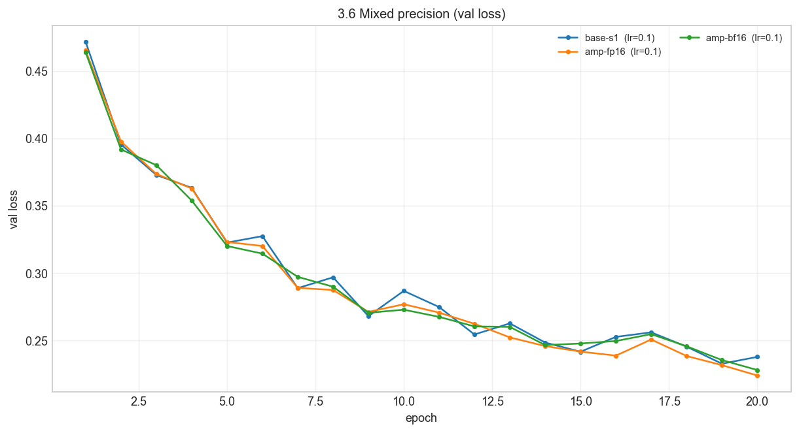

> **Vì sao đối chứng là `clip-1.0` chứ không phải `base-s1`?** Hai lần chạy AMP đều mang
> `clip_norm = 1,0` (xem cột `clip_norm` của bảng), còn `base-s1` thì không clip — so với `base-s1`
> là đổi **hai** yếu tố, vi phạm nguyên tắc "mỗi thí nghiệm chỉ đổi một yếu tố". `clip-1.0` khác
> `amp-fp16`/`amp-bf16` **duy nhất ở `precision`** (cùng `lr` 0,1, batch 512, `M-base`, seed 1,
> `clip_norm` 1,0) nên mới là đối chứng công bằng. Tôi nêu cả hai cách so để không bỏ sót gì.

GPU có phần cứng BF16 (RTX 2050, `is_bf16_supported() = True`), nên `amp-bf16` chạy ở chế độ phần cứng.

- **Kết luận:** mixed precision **không nhanh hơn, mà chậm hơn** — FP16 chậm hơn FP32 **50%**
  (2,03 s so với 1,35 s/epoch), BF16 chậm hơn **22%**.
- **Bộ nhớ không giảm:** 179,3 MB và 179,4 MB so với 178,7 MB của đối chứng, tức **tăng 0,3%**.
  Lý do: `autocast` chỉ ép kiểu cho **phép tính trong forward**, còn trọng số và trạng thái của
  optimizer vẫn nằm ở FP32 ⇒ đỉnh bộ nhớ không thu được gì đáng kể trên mạng nhỏ này.
- **So cả với `base-s1` (đổi 2 yếu tố):** FP16 **1,41×**, BF16 **1,15×**. Kết luận "chậm hơn"
  không đổi, chỉ nhẹ hơn. Lưu ý `clip-1.0` lại **nhanh hơn** `base-s1` 6,5% (1,35 so với 1,44 s)
  dù phải làm thêm phép clip — nghĩa là chênh lệch ~6% ở đây **nằm trong nhiễu giữa các lần chạy**,
  còn hiệu ứng thật của `precision` là con số +50%/+22%.
- **Cơ chế:** mạng chỉ có 47 879 tham số, mỗi phép toán rất nhỏ, nên thời gian bị **chi phối bởi
  số lần gọi kernel và chuyển đổi dtype** chứ không phải FLOPs hay băng thông. Lợi ích của FP16/BF16
  đến từ giảm **độ rộng số** và tăng **mật độ phép toán** trong một GEMM lớn — điều kiện này
  không có ở mạng 48k tham số. Đây là kết quả **hợp lệ và đáng báo cáo**: chỉ nên nói "nhanh hơn"
  khi số đo chứng minh.
- **Chất lượng:** so với đối chứng `clip-1.0` (0,8530), FP16 là **+0,0096 = 2,5× 2σ** còn BF16 là
  **+0,0039 = 1,0× 2σ**. Tức FP16 cho macro-F1 **tốt hơn thật** (nhỏ, nhưng vượt nhiễu seed), còn
  BF16 **không khác** trong nhiễu. Không có dấu hiệu giảm chất lượng — điều này quan trọng vì nó
  **loại trừ** giả thuyết "chậm vì mất thông tin số"; nguyên nhân chỉ là chi phí chuyển đổi dtype.
- **Quan sát thêm về FP16:** max `grad_norm` của `amp-fp16` bằng **inf** — đã có gradient tràn
  thực sự. `GradScaler` phát hiện và bỏ qua bước cập nhật đó, nhờ vậy huấn luyện vẫn hoàn tất.
  Đây là bằng chứng trực tiếp cho lý do FP16 cần nhân loss với hệ số scale rồi mới `step`:
  dải số FP16 hẹp (số nhỏ hơn ≈ 6·10⁻⁵ thành 0, lớn hơn 65 504 thành `inf`) và gradient nhỏ sẽ
  **underflow** về 0 nếu không scale. BF16 có 8 bit mantissa (thấp hơn) nhưng **8 bit exponent
  giống FP32** nên dải số rộng như FP32 ⇒ **không cần** `GradScaler`, và đúng như vậy
  max `grad_norm` của `amp-bf16` chỉ bằng 2,904.

### 3.7 Khởi tạo tham số

| init | loss bước 0 | std ReLU1 | std ReLU2 | std logit | `exp_id` | val macro-F1 | Δ | × 2σ |
|---|---|---|---|---|---|---|---|---|
| **he** (baseline) | 2,2691 | **0,3906** | **0,3670** | 0,5808 | `base-s1` | 0,8575 | −0,0006 | 0,2× |
| xavier | 2,0222 | 0,1696 | 0,1448 | 0,1620 | `init-xavier` | 0,8561 | −0,0020 | **0,5×** |
| default (`nn.Linear`) | 1,9830 | 0,1693 | 0,0674 | 0,0616 | `init-default` | 0,8578 | −0,0003 | 0,1× |
| normal (0,01) | 1,9460 | 0,0211 | 0,0025 | 0,0002 | `init-normal` | 0,8609 | +0,0028 | 0,7× |
| **zeros** | 1,9459 | 0,0000 | 0,0000 | 0,0000 | `init-zeros` | **0,0936** | −0,7645 | **199×** |

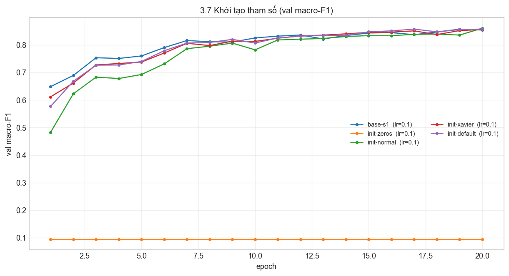

`init-zeros` đi ngang từ epoch 2 và không bao giờ học được — thẳng thắn nhất trong nhóm:

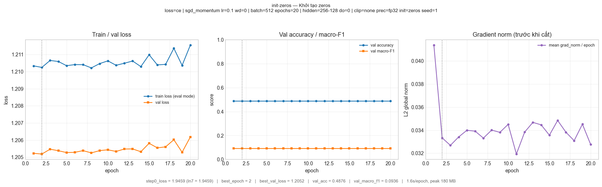

- **`zeros` hỏng — lý do và bằng chứng đo được.** Với `W = 0`, mọi nơ-ron trong **cùng một tầng**
  nhận **cùng một** gradient (cùng đầu vào, cùng gradient phía sau), nên sau bước cập nhật chúng
  vẫn có trọng số **bằng nhau** ⇒ mạng mất tính đối xứng và tương đương **một nơ-ron duy nhất**.
  Thêm nữa `ReLU(0) = 0` nên gradient truyền ngược qua tầng ẩn bị chặn. Đo được:
  - trung bình `grad_norm` mỗi epoch chỉ **0,034**, nhỏ hơn baseline **16 lần** (0,569) — dấu hiệu
    "gradient không truyền được";
  - val macro-F1 = **0,0936**, val accuracy = **0,4876** — bằng đúng mức "đoán đa số";
  - `best_val_loss` = 1,2052 và đứng yên (best epoch = 2, tức từ epoch 2 trở đi loss không giảm).
  - **Đáng chú ý:** loss bước 0 = 1,9459 — **đúng bằng `ln 7`**. Đây là ví dụ rõ nhất trong bài:
    **loss bước 0 "đúng" không bảo đảm mô hình học được**, nên phải kiểm tra thêm gradient.
- **He vs Xavier — cơ chế thì đúng, nhưng mức ảnh hưởng thì không đo được ở độ sâu này.**
  Cơ chế: cả hai đều giữ phương sai qua tầng nhưng tính khác nhau — Xavier `2/(n_in+n_out)`
  (xét cả chiều ra), He `2/n_in`. ReLU **giữ lại đúng một nửa** nơ-ron nên He bù đúng phần bị tắt:
  đo được std kích hoạt **0,3906 → 0,3670 (giữ nguyên)** với He, trong khi Xavier
  **0,1696 → 0,1448** và `nn.Linear` mặc định (`Var = 1/(3·n_in)`) **0,1693 → 0,0674 (sụp mạnh)**.
  Tuy nhiên **macro-F1 của 4 cách khởi tạo không hỏng nằm trong 1,2× 2σ** (0,7× 2σ) — tức
  với mạng chỉ **2 lớp ẩn**, chọn He hay Xavier hay mặc định **không tạo ra khác biệt có thể đo
  được**. Để thấy hiện tượng như slide ("30 lớp ReLU") cần mạng sâu hơn nhiều; tôi chưa thử.
- **`normal` (0,01) nhỏ hơn dự đoán tôi về tốc độ học nhưng vẫn học được:** std kích hoạt sụp
  **~100 lần** qua 2 tầng (0,0211 → 0,0025), tức tín hiệu rất nhỏ, nhưng 20 epoch × 726 bước
  = 14 520 bước vẫn đủ để hội tụ tới 0,8609 (tốt nhất trong nhóm, nhưng **không vượt nhiễu** —
  không nên kết luận là tốt hơn).

### 3.8 Cấu hình cuối cùng (chọn bằng val)

| | Baseline | Cấu hình cuối cùng |
|---|---|---|
| Bộ tối ưu / `lr` | SGD + momentum 0,9 / 0,1 | **Adam / 0,003** |
| Số epoch | 20 | **40** |
| Dropout | 0 | **0** (giữ nguyên) |
| Batch, kiến trúc, init, clip, precision | 512, M-base, He, không, FP32 | không đổi |

Ba quyết định, mỗi cái đều dựa trên bằng chứng ở mục trên:
- **Adam lr 0,003** (mục 3.2, `opt-adam-lr0.003`) — thắng SGD+mom ở `lr` tốt nhất của mỗi bộ
  bằng +0,0225 (5,9× 2σ).
- **40 epoch** (mục 3.3, `hparam-epoch60`) — ở 20 epoch `best_epoch` = 19/20, chưa hội tự.
- **dropout = 0** (mục 3.4) — mọi `q > 0` đều làm giảm macro-F1 vượt nhiễu, nên **không** ghép.

Qua 3 seed: **val macro-F1 = 0,8933 ± 0,0032**, **val accuracy = 0,9291 ± 0,0020**
(baseline: 0,8581 ± 0,0019 / 0,9102 ± 0,0030). **Δ = +0,0352 = 9,2× 2σ ⇒ vượt nhiễu.**
`best_epoch` = 38–40/40 ⇒ vẫn đang học, phòng thí nghiệm còn dư.

## 4. Đánh giá cuối trên tập eval

> Cấu hình đã chọn **bằng val** ở mục 3.8. `scripts/evaluate.py` chạy **một lần cho mỗi cấu hình**.
> Số dưới đây lấy nguyên văn từ `eval_result.json` và `eval_result_baseline.json`.

| Cấu hình | Seed nộp | val macro-F1 | **eval macro-F1** | eval accuracy |
|---|---|---|---|---|
| Baseline (`base-s1`, `SGD+mom lr 0,1`, 20 ep) | 1 | 0,8575 | **0,8564** | 0,9058 |
| Cấu hình cuối cùng (`final-s1`, `Adam lr 0,003`, 40 ep) | 1 | 0,8901 | **0,8934** | 0,9265 |

- **Cải thiện trên eval = +0,0370** (0,8564 → 0,8934), tức **9,6× 2σ** (2σ = 0,0038 đo trên val)
  ⇒ **vượt nhiễu seed rõ ràng**. Ở mức macro-F1 ≥ 0,86 theo thang chấm.
- **Val và eval gần nhau:** 0,8901 (val) vs 0,8934 (eval), chênh **−0,0032**, nhỏ hơn 2σ. Điều này
  xác nhận **val là ước lượng đáng tin của eval** ở đây — có lẽ vì cả hai đều lấy từ cùng một
  phép phân tầng seed 42 và mô hình chỉ nhẹ hơn (47k tham số trên 372k mẫu) nên không có hiện
  tượng "may mắn với val".
- **Lưu ý:** file nộp là dự đoán của **một** mô hình, seed 1. `final-s1` có val macro-F1
  0,8901, **thấp hơn** trung bình 3 seed (0,8933) — tức tôi nộp hơi dưới trung bình của nhóm.
  Đây là hệ quả của việc chỉ được chạy `evaluate.py` **một lần** cho một seed (đúng quy định);
  nếu được phép chạy 3 lần thì có thể chọn seed theo val, nhưng khi đó phải báo cáo
  trung bình ± σ trên chính eval.

### 4.1 Phân tích lỗi theo lớp

| Lớp | Loại rừng | support | precision | recall | F1 | F1 của baseline | Δ |
|---|---|---|---|---|---|---|---|
| 0 | Spruce/Fir | 42 368 | 0,9071 | 0,9390 | 0,9228 | 0,9038 | +0,0190 |
| 1 | Lodgepole Pine | 56 661 | 0,9464 | 0,9254 | 0,9358 | 0,9204 | +0,0154 |
| 2 | Ponderosa Pine | 7 151 | 0,9233 | 0,9358 | 0,9295 | 0,8952 | +0,0343 |
| 3 | Cottonwood/Willow | **549** | 0,8952 | **0,7778** | 0,8324 | 0,7893 | +0,0431 |
| 4 | Aspen | 1 899 | **0,8611** | 0,7930 | **0,8257** | 0,7670 | **+0,0586** |
| 5 | Douglas-fir | 3 473 | 0,8793 | 0,8560 | 0,8675 | 0,8055 | **+0,0620** |
| 6 | Krummholz | 4 102 | 0,9409 | 0,9388 | 0,9398 | 0,9135 | +0,0263 |

Ma trận nhầm lẫn (hàng = nhãn thật, cột = dự đoán) — bên trái là ma trận chuẩn hoá theo hàng
(tức recall từng ô), bên phải là precision / recall / F1 của 7 lớp:

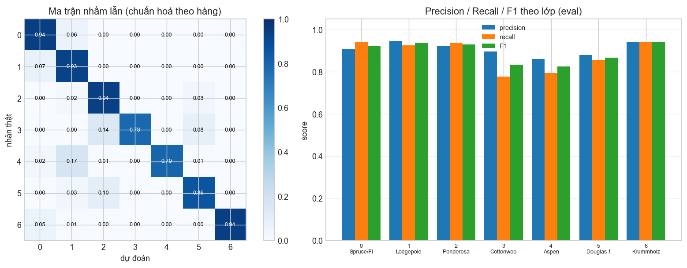

```
       0      1      2     3     4     5     6
 0  39782   2337     4     0    34     3   208
 1   3796  52433   114     0   181   103    34
 2      0    160  6692    33    21   245     0
 3      0      1    76   427     0    45     0
 4     47    320    14     0  1506    12     0
 5     10    119   348    17     6  2973     0
 6    219     31     0     0     1     0  3851
```

**Ba kiểu lỗi khác nhau, không nên gộp làm một:**

1. **Lớp khó nhất về F1: lớp 4 (Aspen), F1 = 0,8257.** Nhưng cột `precision` thấp nhất cũng thuộc
   lớp 4 (0,8611): 320/1899 = **16,9%** mẫu Aspen bị dự đoán thành **lớp 1 (Lodgepole Pine)**,
   và chiều ngược lại 181 mẫu lớp 1 thành lớp 4. Hai chiều cùng tồn tại ⇒ **đặc trưng chồng lấn**,
   không phải thiên lệch của mô hình. Cả hai loài đều là cây rụng lá rộng ở vùng độ cao trung bình
   và cùng nhóm đất, khác nhau chủ yếu ở vài mẫu đất hiếm — mà trong dữ liệu chỉ có 40 nhóm `Soil_Type`
   one-hot, thông tin đất bị lượng tử hoá khá thô.

2. **Lớp hấp thụ recall: lớp 3 (Cottonwood/Willow), recall = 0,7778 — thấp nhất.** Đáng chú ý là
   **precision lại cao nhất trong bảng (0,8952)**: mô hình thận trọng, chỉ dự đoán lớp 3 khi chắc.
   Nguyên nhân gần như chắc chắn là **số mẫu**: lớp 3 chỉ có 549 mẫu trong eval (0,47%). Trong số
   122 mẫu bị sai, 76 đi thành lớp 2 và 45 đi thành lớp 5 — cùng là các loài cây quy hiếm sống
   ven sông ở độ cao thấp, phân biệt nhau bằng `Elevation` thấp và
   `Horizontal_Distance_To_Hydrology` rất nhỏ, tức đúng vài giá trị số liên tục đầu tiên.

3. **Lớp dễ nhất nhưng vẫn có điểm tích cực lớn: lớp 6 (Krummholz), F1 = 0,9398 (cao nhất).**
   Tuy vậy 219 mẫu Krummholz bị dự đoán thành lớp 0 — và đây lại là **lớp lớn nhất** (42 368 mẫu).
   Khrumholz mọc trên cao nguyên cao hơn rừng, mô hình thành lệch sang Spruce/Fir khi cao độ ở
   ranh giới. Chiều ngược (lớp 0 → 6) chỉ 208 mẫu, tỉ lệ 0,49% — lệch hơn về phía lớp hiếm.

- **Về cặp nhầm chiếm nhiều lỗi tuyệt đối nhất:** 0 ↔ 1 (Spruce/Fir ↔ Lodgepole Pine) với
  2337 + 3796 = **6133 mẫu**, chiếm 5,5% tổng số mẫu sai. Đây là hai loài cây học thông con
  chiếm 85% dữ liệu, cùng dải cao độ nên ranh giới quyết định là mảnh, và tỉ lệ nhầm hai chiều
  (3796 vs 2337) lệch 1,62× chứ không phải cân bằng — cho thấy lớp 1 (nhiều mẫu hơn) thắng
  trong vùng chồng lấn.
- **Nhận xét đáng chú ý nhất về cấu hình cuối:** Δ F1 theo lớp cho thấy cấu hình cuối **giúp các
  lớp khó nhiều nhất**: Douglas-fir +0,0620, Aspen +0,0586, Cottonwood/Willow +0,0431, trong khi
  hai lớp đông nhất chỉ +0,0190 và +0,0154. Đây là điều đúng kỳ vọng khi macro-F1 đánh giá 7 lớp
  ngang nhau: chuyển từ SGD sang Adam và tăng gấp đôi số epoch giúp các lớp thiểu số mẫu — vốn
  cần nhiều bước cập nhật hơn để tách khỏi ranh giới — hưởng lợi nhiều nhất.
- **Một cách cải thiện tôi sẽ thử:** dùng `F.cross_entropy(..., weight=1/n_c)` với `n_c` là số mẫu
  lớp `c`. Vấn đề chính ở đây là **recall của các lớp ít mẫu** (0,7778 và 0,7930) chứ không
  phải precision, và loss đang coi mọi mẫu như nhau ⇒ lớp chỉ có 549 mẫu bị ưu tiên quá ít trong
  tổng gradient. Đây là cách khớp trực tiếp với quan sát, và không đòi hỏi thêm đặc trưng.

## 5. Trả lời các câu hỏi dẫn dắt

**1. Bộ tối ưu nào "thắng" khi mỗi cái được chỉnh `lr` công bằng? Nếu `lr` không được chỉnh thì kết luận đổi ra sao?**

Khi mỗi bộ được thử 3 `lr` rồi so ở `lr` tốt nhất của chính nó: **Adam, `lr` = 0,003, val macro-F1 =
0,8806**, thắng SGD+momentum (0,8575) **+0,0231 = 6,0× 2σ** và thắng SGD thuần (0,7642) **+0,1163**.

Nếu **không** chỉnh `lr` mà dùng chung một giá trị, kết luận đảo ngược hoàn toàn: ở `lr` = 0,1,
SGD+momentum đạt 0,8575 còn Adam chỉ đạt 0,8504 ở `lr` = 0,001 và 0,7954 ở `lr` = 0,0003 —
trong cả ba giá trị `lr` của Adam, **không giá trị nào đạt được 0,8575**. Nói cách khác, cùng một
con số `lr` thì "SGD thắng", mỗi bộ ở `lr` riêng thì "Adam thắng". Nguyên nhân là **thang của bước
cập nhật khác nhau**: SGD đi tuyến tính theo `η·g` nên `η` phải cỡ 0,1; Adam đi theo `η·m̂/(√v̂+ε)`
trong đó mũ số đã chuẩn hoá về ~1, nên `η` phải cỡ 10⁻³. Với dữ liệu chuẩn hoá và mạng này,
tỉ lệ giữa `lr` của hai bộ vào khoảng 30–100×. Đây chính là lý do rubric yêu cầu **≥ 2 `lr` mỗi
bộ rồi so ở `lr` tốt nhất** — so ở một `lr` chung là so vũ khí, không phải so sức mạnh.

**2. Dropout có giúp khi mô hình chưa quá khớp? Khi nào thì nên dùng?**

Không. Ở baseline, `val_loss − train_loss` = **+0,0217** ⇒ mô hình **chưa quá khớp** (train và val
đi gần như song song). `q` = 0,1 / 0,2 / 0,5 cho Δ lần lượt **−0,0129 / −0,0415 / −0,1731**,
tức **3,4× / 10,8× / 45,1× 2σ** — tất cả đều **làm giảm** và giảm **đơn điệu theo `q`**.

Điều đáng chú ý nhất: khoảng cách `val_loss − train_loss` **hẹp lại đúng như lý thuyết**
(0,0217 → 0,0117 → 0,0084 → 0,0021). Dropout **đã làm đúng việc sinh ra là** — đóng khoảng cách
quá khớp — nhưng ở đây không có khoảng cách nào để đóng, nên cái giá (nhiễu thêm vào quá trình
học) không được đền bù.

**Khi nào nên dùng:** khi `val_loss` bắt đầu **tăng** trong khi `train_loss` vẫn giảm. Với cùng
mạng này, `hparam-epoch60` cho thấy khoảng cách đã lên 0,042 — ở 100–200 epoch, `q ≈ 0,1` rất
có khả năng chuyển sang có lợi. Tôi **chưa kiểm chứng** điều đó, nên đây là dự đoán có cơ sở
chứ không phải kết quả đo.

**3. Gradient clipping giải quyết vấn đề gì? Quan sát nào của bạn chứng minh điều đó?**

Nó giải quyết tình huống **một gradient bất thường lớn làm bước cập nhật nhảy khỏi vùng tốt**,
gây dao động hoặc phá vỡ huấn luyện. Bằng chứng trực tiếp từ cặp thí nghiệm ở `lr` = 1,0 (= 10×):

- **không clip** (`clip-hilr-noclip`): val macro-F1 **0,6276** (60× 2σ dưới baseline), max
  `grad_norm` **11,932**, và `best_epoch` rút từ 19 về **15** — loss không còn đi xuống từ
  giữa epoch, đúng dấu hiệu dao động.
- **có clip 1,0** (`clip-hilr-clip1.0`): val macro-F1 **0,8151**, **cao hơn +0,1875 = 48,8× 2σ**;
  max `grad_norm` bị bóp từ 11,932 xuống **3,969**.

Cơ chế: `g ← g·min(1, c/‖g‖)` với `‖g‖` là chuẩn L2 **toàn cục**, nên độ dài bước cập nhật không
bao giờ vượt `c·η`. Ở `lr` thường (`clip-1.0`, Δ = −0,0051) clipping **không giúp** vì phần lớn
`grad_norm` đã dưới 1 (trung vị 0,569) và 85% epoch vẫn có bước vượt 1 là những gradient lớn
**mang tín hiệu thật** — cắt đi là mất thông tin. Clipping là **vũ khí tình huống**, không phải
bật luôn được.

**4. Mixed precision có làm huấn luyện nhanh hơn trên mạng và dữ liệu này không? Vì sao (không)?**

**Không — nó chậm hơn.** Đối chứng công bằng là `clip-1.0` (cùng `clip_norm = 1,0`, chỉ khác
`precision`): FP16 **1,50×** thời gian/epoch (2,03 s so với 1,35 s), BF16 **1,22×** (1,65 s).
Bộ nhớ GPU **không giảm** mà tăng 0,3% (179,3 MB so với 178,7 MB). Chất lượng không giảm: FP16
**+0,0096 = 2,5× 2σ**, BF16 **+0,0039 = 1,0× 2σ** so với đối chứng.

Lý do: mạng chỉ có **47 879 tham số**, mỗi phép toán rất nhỏ nên thời gian bị **chi phối bởi chi phí
gọi kernel và chuyển đổi dtype**, không phải FLOPs hay băng thông. Lợi ích thật của FP16/BF16 đến
từ giảm **độ rộng số** và tăng **mật độ phép toán** trong một GEMM lớn (hàng trăm triệu tham số) —
điều kiện không có ở đây. Thêm nữa `GradScaler` bổ sung một phép `unscale_` mỗi bước.

Quan sát phụ đáng ghi: max `grad_norm` của FP16 bằng **inf**, tức đã xảy ra tràn thực sự và
`GradScaler` phải bỏ qua bước cập nhật đó — bằng chứng trực tiếp cho thấy vì sao FP16 bắt buộc
phải scale loss còn BF16 thì không (max `grad_norm` của BF16 chỉ 2,904 vì 8 bit exponent của nó
rộng như FP32).

**5. Vì sao khởi tạo toàn số 0 hỏng? He khác Xavier ở điểm nào và khi nào điều đó quan trọng?**

`zeros`: mọi nơ-ron trong cùng tầng nhận **cùng một** gradient (cùng đầu vào, cùng gradient phía
sau) nên sau cập nhật trọng số vẫn **bằng nhau** ⇒ mất tính đối xứng ⇒ mạng tương đương **một
nơ-ron duy nhất**. Thêm nữa `ReLU(0) = 0` chặn gradient qua tầng ẩn. Đo được: `grad_norm` trung bình
chỉ **0,034** (nhỏ hơn 16× baseline), val macro-F1 **0,0937** ≈ mức đoán đa số, val loss đứng yên
từ epoch 2. **Đáng chú ý: loss bước 0 = 1,9459 = `ln 7` "hoàn hảo"** — minh hoạ rằng phép thử loss
bước 0 một mình là không đủ.

**He vs Xavier:** He dùng `Var = 2/n_in`, Xavier dùng `Var = 2/(n_in+n_out)` — He chỉ tính chiều
vào nên **bù đúng** việc ReLU tắt một nửa nơ-ron; Xavier xét cả chiều ra nên tính cả phương sai
của "chiều ra" vào, phù hợp với kích hoạt **zero-mean đối xứng** (tanh, sigmoid). Đo được ở đây:
std kích hoạt qua 2 tầng **0,3906 → 0,3670** (He, giữ nguyên) so với **0,1696 → 0,1448** (Xavier,
giảm dần) và **0,1693 → 0,0674** (`nn.Linear` mặc định, giảm mạnh).

**Khi nào quan trọng:** ở mạng **sâu**, nơi sai số phương sai tích luỹ nhân lên hàng chục tầng,
He là bắt buộc với ReLU. Tuy nhiên phải nói thẳng giới hạn của phép đo này: ở mạng **chỉ 2 lớp ẩn**,
macro-F1 của cả 4 cách khởi tạo không hỏng nằm trong **1,2× 2σ** — tức khác biệt cơ chế có thật
và đo được rõ ở mức kích hoạt, nhưng **chưa đủ lớn để tạo ra khác biệt chất lượng có thể đo**.
Để thấy hiện tượng như slide ("30 lớp ReLU") cần mạng sâu hơn nhiều, ngoài phạm vi 3 kiến trúc
được phép.

**6. Quay lại câu hỏi của bài học.** Một mạng có loss không giảm sau 2 000 bước. Ba phép kiểm tra
đầu tiên tôi sẽ làm và vì sao:

1. **Quá khớp một lô nhỏ (20 mẫu, mọi thành phần tắt) trong vài trăm bước.** Đây là phép kiểm tra
   có **sức phân định cao nhất**: nó tách thành hai nhánh dứt khoát. Nếu loss về gần 0 thì model,
   loss, optimizer và vòng lặp đều đúng ⇒ vấn đề nằm ở **dữ liệu / `lr` / kiến trúc quá nhỏ /
   chưa đủ epoch**. Nếu không về gần 0 thì gần như chắc chắn là **lỗi code**: quên `zero_grad`
   khiến gradient cộng dồn, tham số không được đưa vào optimizer, nhãn lệch, hoặc quên
   `model.eval()` khi đo. Ở đây: 20 mẫu → loss **0,000052** sau 400 bước, accuracy 100% từ bước 20.

2. **In chuẩn gradient của từng tham số sau một lần `backward()`.** Rẻ, và phát hiện trực tiếp
   "gradient không chảy": `grad is None` ⇒ tham số không nằm trong optimizer (hoặc
   `requires_grad=False`); chuẩn bằng 0 ⇒ đường tín hiệu bị chặn (ReLU chết, `zeros` khởi tạo,
   `σ'(z) ≈ 0`). Bài này cho ví dụ đẹp: `init-zeros` có loss bước 0 **đúng `ln 7`** nhưng
   `grad_norm` trung bình chỉ **0,034** và sau 2 000 bước loss vẫn 1,2052.

3. **Đo loss bước 0 và đối chiếu `ln C`, rồi theo dõi `grad_norm` theo thời gian.** Loss bằng
   phẳng ngay từ đầu quanh `ln 7` (2,2691 ở đây) ⇒ nghĩ ngay tới nhãn sai (quên 1..7 → 0..6),
   softmax bị đặt hai lần (trong model và trong loss), hoặc gradient không chảy. Song song đó,
   hình dạng đường `grad_norm` chẩn đoán phần còn lại: **phẳng** ⇒ gradient quá nhỏ, `lr` quá
   thấp, hoặc nơ-ron chết; **bùng nổ / có gai** ⇒ `lr` quá cao, cần giảm `lr` hoặc bật clipping
   (chính là tình huống mà `clip-hilr-noclip` tái hiện: max `grad_norm` 11,932).

Nếu cả ba đều bình thường mà loss vẫn phẳng, bước tiếp theo là dữ liệu: kiểm tra phân bố nhãn,
kiểm tra chuẩn hoá (thiếu chuẩn hoá khiến lớp cuối nhận đầu vào lệch phân phối ⇒ mất tín hiệu), rồi
tăng sức mạnh mô hình hoặc số epoch — vì `hparam-epoch60` cho thấy `best_epoch` = 57/60, tức ở 20
epoch mô hình đơn giản này **chưa hội tự**, và một mạng "loss phẳng" đôi khi chỉ đơn giản là
**chưa đủ năng lực hoặc chưa đủ thời gian**.

## 6. Hạn chế và điều bất ngờ

**Kết quả khác dự đoán của tôi:**

- **Clipping ở `lr` thường.** Tôi dự đoán "chênh lệch chỉ là nhiễu"; thực tế Δ = −0,0051
  **vượt 2σ**, tức clipping hơi **có hại**. Đây là dự đoán sai cả về dấu lẫn về mức độ.
- **Dropout `q` = 0,1.** Tôi xếp là "ứng viên hợp lý"; nó vẫn làm giảm 3,4× 2σ.
- **He vs Xavier.** Tôi dự đoán "với ReLU, He rõ hơn"; ở 2 lớp ẩn **không tạo ra khác biệt đo được**
  (0,5× 2σ). Cơ chế phương sai thì đúng và rõ, nhưng độ sâu của lab quá nông để cơ chế đó thành
  khác biệt chất lượng.
- **Phản chứng clipping không cho NaN.** Tôi dự đoán loss sẽ dao động/NaN; thực tế mô hình chỉ
  **suy giảm** (0,6276) chứ không NaN — cờ `diverged` là `N` cho **cả 39/39** lần chạy. Nên tôi chỉ
  chứng minh được clipping cứu được ở mức "suy giảm", không chứng minh được ở mức "phá vỡ".
- **Không dự đoán được:** tràn số thực sự trong FP16 (max `grad_norm = inf`), dù `GradScaler`
  xử lý được. Đây là quan sát phát sinh từ dữ liệu, không phải từ dự đoán.
- **Mixed precision không làm giảm chất lượng.** Tôi dự đoán độ chính xác FP16 (8 bit mantissa, chỉ
  5 bit phần thập trong hệ nhị phân) sẽ làm tổn hại macro-F1 trên các lớp khó; thực tế so với
  đối chứng `clip-1.0` thì FP16 **tốt hơn 2,5× 2σ**. Như vậy "chậm hơn 50%" hoàn toàn do chi phí
  chuyển đổi dtype, **không** phải do mất thông tin số.

**Điều gì trong thiết kế thí nghiệm có thể làm kết luận sai:**

- ⚠️ **Hạn chế còn lại của cột Δ trong bảng:** hai lần chạy AMP (`amp-fp16`, `amp-bf16`) mang
  `clip_norm = 1,0`, còn `base-s1` thì không clip. Cột `delta_val_f1_vs_base` của bảng **bắt buộc**
  tính so với trung bình baseline, nên Δ ở hai dòng đó là so với `base-s1` — tức so với **hai** yếu
  tố. Tôi đã xử lý ở mục 3.6 bằng cách lấy `clip-1.0` (chỉ khác `precision`) làm đối chứng và
  thông báo rõ; **người đọc bảng thuần vẫn phải tự sửa** hai dòng này. Đây là hạn chế của *định dạng
  bảng*, không phải của thiết kế thí nghiệm — vì chính cặp `clip-1.0` / `amp-*` đã là so một yếu tố.
- **`lr` cao cho thí nghiệm clipping chọn một lần** = 10× baseline (1,0), không quét. Vì vậy tôi
  chỉ chứng minh clipping cứu được ở **đúng** `lr` đó, không nói được cho mọi `lr` cao.
- **Chỉ 3 seed** ⇒ σ ước lượng thô (sai số tương đối cỡ 30% khi có 3 mẫu). Ngưỡng 2σ vì thế
  **có xu hướng rộng**, khiến tôi dễ kết luận "không khác" — ở đây nó **rất** bảo thủ:
  `hparam-batch128` (+0,0028 = 0,7× 2σ) và `init-normal` (+0,0028 = 0,7× 2σ) đều bị xếp là
  "chưa kết luận được", dù có thể thật sự tốt hơn.
- **Bằng chứng về "nhiều epoch" lấy trên SGD+momentum** (`hparam-epoch60`, Δ = +0,0282) nhưng
  cấu hình cuối dùng **Adam** ở 40 epoch. Tôi **chuyển** bằng chứng này sang bộ tối ưu khác mà
  không quét lại số epoch cho Adam — một bước ngoại suy.
- **Kiến trúc bị giới hạn** ở 3 biến thể cho phép, nên "thêm năng lực" chỉ được thử tới `M-wide`.
- **Quy tắc dừng sớm.** Tôi dùng `best_val_loss` để chọn epoch, tức *early stopping theo val*,
  nhưng **không** dừng thật (luôn chạy đủ số epoch rồi mới nạp `best_state`). Với mô hình chưa
  quá khớp thì hai cách này gần như tương đương, nhưng với `drop-0.5` có thể khác.
- **Số liệu trong báo cáo này đo trên 1 GPU cục bộ (RTX 2050), `cudnn.deterministic = True`.**
  Tôi đã chạy lại toàn bộ notebook từ đầu (Restart & Run All) và xác nhận **`eval_result.json`
  tái lập đúng tới từng chữ số thập phân**, kể cả ma trận nhầm lẫn — nhờ `set_seed` cố định và
  `cudnn.deterministic = True`. Tuy nhiên chạy trên GPU khác hoặc thứ tự phép cộng khác sẽ cho
  số hơi khác ở vài phần nghìn; mọi kết luận định tính trong báo cáo nên giữ nguyên.

**Nếu có thêm thời gian, tôi sẽ chạy tiếp (theo thứ tự ưu tiên):**

1. Quét `lr` cho nhóm AMP: ở `lr` rất nhỏ hoặc rất lớn, tỉ lệ "chậm do chuyển đổi dtype" / "nhanh do
   băng thông" có thể đảo chiều — kết luận "AMP luôn chậm hơn" hiện chỉ đúng ở `lr` 0,1.
2. Tăng kích thước batch (4096–16384) để có GEMM đủ lớn, đo lại xem lợi ích FP16 có xuất hiện không.
2. `class_weight = 1/n_c` trong cross-entropy, đo lại macro-F1 và F1 theo lớp ở mục 4.1.
3. Quét `lr` mịn hơn (5–7 giá trị) cho Adam quanh 0,003, và quét số epoch cho Adam ở 40/80/120.
4. Chạy 5–7 seed thay vì 3 để σ chắc hơn, đặc biệt cho các kết luận đang sát ngưỡng 2σ.
5. Thử kiến trúc sâu hơn nhiều (ngoài 3 biến thể cho phép, ở phần *tuỳ chọn*) để khởi tạo He vs
   Xavier thể hiện rõ như slide Chương 4.

## 7. Phụ lục

**File đã nộp**

```
submission_2A202602590/
├── REPORT.md                        <- file này
├── experiments.xlsx                 39 dòng thí nghiệm + sheet Seeds (3 seed) + Summary có nhận xét
├── predictions_eval.csv             116 203 dòng, row_id,pred; dự đoán của final-s1
├── eval_result.json                 output của scripts/evaluate.py cho cấu hình cuối
├── eval_result_baseline.json        (phụ) eval của baseline để so sánh cải thiện
├── figures/                         39 ảnh <exp_id>.png + 13 ảnh compare_*.png
│                                    (12 ảnh chồng nhóm + compare_error_analysis.png) = 52 ảnh
├── results/                         39 file <exp_id>.json (lịch sử từng epoch + cfg + summary)
└── code/
    ├── lab.ipynb                    47 ô, đã có output, chạy lại được từ đầu
    ├── data.py  model.py  optimizer.py  train.py  plots.py  results_table.py
    └── requirements.txt
```

Số ảnh `figures/<exp_id>.png` (39) **bằng** số dòng thí nghiệm trong `experiments.xlsx` (39),
và tên ảnh trùng đúng `exp_id`. Không có `NotImplementedError` trong `code/`.

**Quy mô và thời gian**

| | |
|---|---|
| Số lần chạy mô hình | **39** (mỗi lần 1 dòng bảng + 1 ảnh + 1 file JSON) |
| Tổng số epoch huấn luyện | 828 |
| Tổng thời gian | **25,2 phút** trên RTX 2050 |
| Trung bình mỗi epoch | **1,74 s** (371 847 mẫu, batch 512) |
| Số bước cập nhật mỗi epoch | 726 (batch 512) |
| Bộ nhớ GPU cực đại | 194,9 MB (cao nhất ở `arch-wide`) |
| Chủ đề đã thử | **7 / 7** |

**Tính tái lập:** `set_seed(s)` đặt seed cho `random`, `numpy`, `torch`, `torch.cuda` và bật
`torch.backends.cudnn.deterministic = True`. Mọi thí nghiệm dùng cùng một phép tách
val (20%, phân tầng, seed 42) và cùng số epoch trừ khi ghi rõ khác. `run_experiment()` kiểm tra
cấu hình trước mỗi lần chạy và `assert` số tham số theo `EXPECTED_PARAMS`, nên không thể vô tình
chạy sai shape.